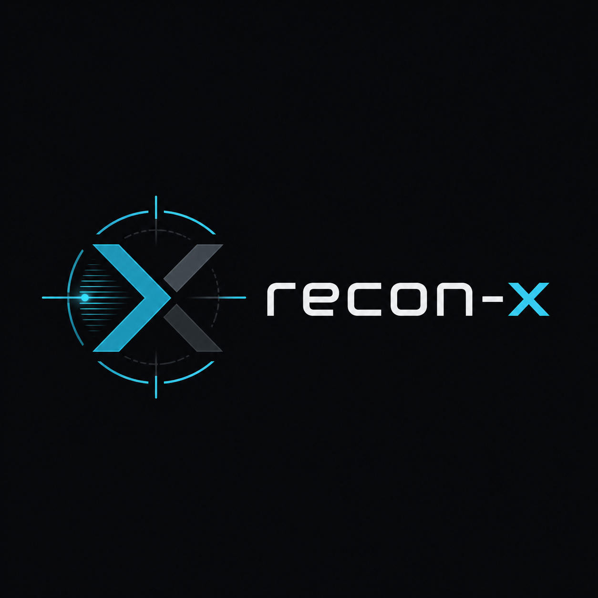

# recon-x

<p align="center">
  
</p>

<p align="center">
  <a href="https://github.com/bytezora/recon-x/releases"></a>
  <a href="https://github.com/bytezora/recon-x/actions"></a>
  
  <a href="LICENSE"></a>
</p>

<p align="center">
  <b>Fast attack-surface and source-aware reconnaissance with CVE evidence, SARIF, Markdown and self-contained HTML reports.</b>
</p>

`recon-x` is an authorized security reconnaissance tool for bug bounty, pentest and DevSecOps workflows. It supports two first-class targets: external domains and source repositories. One command runs 35 domain modules across passive OSINT, DNS, ports, HTTP, CVE matching, WAF, TLS, CORS, SQLi, XSS, SSRF, LFI, Host Header Injection, JWT analysis, Wayback Machine, Shodan, XXE, Command Injection, GraphQL and custom templates, plus source-aware scanners for secrets, dependency manifests, risky config and route inventory.

> Findings are indicators, not confirmed vulnerabilities. Scan only authorized targets.

<p align="center">
  
  <br/>
  <sub>High-precision CVE workflow with Nmap XML import, live NVD enrichment and public-service assurance.</sub>
</p>

---

## Contents

- [Highlights](#highlights)
- [Current Snapshot](#current-snapshot)
- [Screenshots](#screenshots)
- [Install](#install)
- [Usage](#usage)
- [Source-aware scanning](#source-aware-scanning)
- [Workspace projects](#workspace-projects)
- [API server](#api-server)
- [Flags](#flags)
- [Modules](#modules)
- [CVE matching](#cve-matching)
- [Output](#output)
- [Config file](#config-file)
- [CI and automation](#ci-and-automation)
- [Documentation](#documentation)
- [Safety](#safety)

## Highlights

| Area             | Capability                                                                                                             |
| ---------------- | ---------------------------------------------------------------------------------------------------------------------- |
| Discovery        | Passive OSINT, subdomain brute-force, vhost discovery, ASN, WHOIS, Wayback and Shodan enrichment                       |
| Network          | TCP ports, banner grabbing, Nmap XML import, HTTP probing, TLS checks and screenshots                                  |
| Web checks       | CORS, open redirect, SQLi, XSS, SSRF, LFI, XXE, Command Injection, JWT and Host Header Injection                       |
| CVE intelligence | 177 offline CVE signatures across 48 products, live NVD enrichment, CISA KEV, FIRST EPSS and strict precision profiles |
| Evidence         | CVE proof mode against ground truth and real-domain assurance reports for public service/version CVEs                  |
| Source-aware     | Repository scanning for secrets, dependency manifests, risky config and application routes                             |
| Reporting        | Self-contained HTML, JSON, Markdown, SARIF, local report serving and scan-to-scan diffing                              |
| Product core     | Local workspace projects, scan inventory, triage state, quotas, audit trail, REST API and RBAC policy engine           |
| Automation       | CI profile, stable fingerprints, baseline suppression, `.reconxignore`, fail gates, GitHub Action and pre-commit hook  |

## Current Snapshot

| Metric                  |                                                       Value |
| ----------------------- | ----------------------------------------------------------: |
| Recon modules           |                                                          35 |
| Source scanners         |                                                           4 |
| Workspace model         |       Projects + scans + findings + triage + quotas + audit |
| API layer               | Bearer-token REST API + role policy + scoped project access |
| Built-in YAML templates |                                                          54 |
| Offline CVE signatures  |                                                         177 |
| CVE product families    |                                                          48 |
| Default TCP ports       |                                                          17 |
| Output formats          |                                 HTML, JSON, Markdown, SARIF |
| CVE proof workflows     |               Ground-truth evidence + real-domain assurance |

## Screenshots

<p align="center">
  
  <br/>
  <sub>Self-contained HTML report with CVE priorities, CPE evidence, strict policy diagnostics and reproducibility data.</sub>
</p>

## Install

```bash
# go install
go install github.com/bytezora/recon-x@latest

# docker
docker run --rm ghcr.io/bytezora/recon-x:latest scan domain example.com

# pre-built binary
# download from Releases ↓
```

[→ Releases with binaries for Linux / macOS / Windows](https://github.com/bytezora/recon-x/releases)

---

## Usage

```bash
# recommended default scan (safe-by-default standard profile)
recon-x scan domain example.com --output-dir results/example

# minimal passive/light scan
recon-x scan domain example.com --profile safe

# authorized active checks (SQLi, XSS, SSRF, LFI, XXE, CMDi, default creds)
recon-x scan domain example.com --profile active

# specific modules only
recon-x -target example.com -modules subdomain,port,http,sqli,xss,ssrf,lfi

# CI-friendly run: no TUI, JSON, SARIF and Markdown defaults
recon-x scan domain example.com --profile ci --output-dir results/example

# source-aware scan for the current repository
recon-x scan repo . --profile ci --scanners secrets,deps,config,routes --output-dir results/source

# RBAC-ready local project inventory
recon-x project init acme-api --name "Acme API"
recon-x scan repo . --profile ci --project acme-api --output-dir results/source
recon-x project list
recon-x project show acme-api
recon-x project export acme-api --output acme-api.project.json

# local RBAC-ready API over the workspace
recon-x api serve --api-token dev-owner:owner:* --api-listen 127.0.0.1:8090
curl -H "Authorization: Bearer dev-owner" http://127.0.0.1:8090/v1/projects

# correlate discovered source routes with a running app
recon-x scan repo . --url http://localhost:3000 --scanners routes,config --output-dir results/source

# scanner groups for domain mode
recon-x scan domain example.com --scanners dns,http,tls,cve,secrets,cloud --profile ci

# compare only new findings against a previous JSON report
recon-x scan domain example.com --profile ci --baseline results/example/scan.json --output-dir results/latest

# open the self-contained HTML or JSON report locally
recon-x report serve results/example/report.html
recon-x report serve results/source/scan.json

# with Burp proxy + GitHub token
recon-x -target example.com -proxy http://127.0.0.1:8080 -github-token YOUR_GITHUB_TOKEN

# output to JSON, SARIF and Markdown
recon-x -target example.com -json out.json -sarif out.sarif -markdown report.md

# compare with previous scan (diff report)
recon-x -target example.com -json new.json -diff old.json

# Shodan passive recon
recon-x -target example.com -shodan-key YOUR_SHODAN_KEY

# live CVE enrichment with NVD + CISA KEV + FIRST EPSS
recon-x -target example.com -cve-live -nvd-api-key YOUR_NVD_API_KEY

# high-precision CVE mode using Nmap service detection
nmap -sV -oX nmap.xml example.com
recon-x -target example.com -nmap-xml nmap.xml -skip-portscan -cve-live -cve-profile strict

# prove CVE accuracy against a ground-truth lab dataset
recon-x -target lab.local -nmap-xml nmap.xml -skip-portscan -cve-live -cve-profile strict -json scan.json
recon-x -cve-evidence docs/cve-evidence-example.json -cve-evidence-scan scan.json -cve-evidence-report evidence.json -cve-evidence-markdown evidence.md

# evaluate whether a real domain scan is strong enough for a 90% public-service CVE claim
recon-x -cve-assurance scan.json -cve-assurance-report assurance.json -cve-assurance-markdown assurance.md

# resume interrupted scan
recon-x -target example.com -resume

# pipe from file
cat targets.txt | recon-x
```

### Profiles

`recon-x` uses scan profiles so the default workflow is useful without being reckless:

| Profile    | Use                                                                                                            |
| ---------- | -------------------------------------------------------------------------------------------------------------- |
| `safe`     | Passive/minimal attack-surface mapping: DNS, ports, HTTP, TLS, WHOIS, ASN and Wayback                          |
| `standard` | Default workflow: `safe` plus paths, JS, buckets, CORS, GraphQL, admin discovery and templates                 |
| `active`   | Authorized active testing: SQLi, XSS, SSRF, LFI, XXE, Command Injection, default credentials and bypass checks |
| `proof`    | Active checks plus stricter CVE evidence defaults for staging/lab proof runs                                   |
| `ci`       | No-TUI deterministic workflow with JSON, SARIF and Markdown output defaults                                    |
| `full`     | Explicit compatibility profile that enables every module                                                       |

```bash
recon-x profiles
```

### Source-aware scanning

Repository scans are designed for local development and CI. They do not execute exploits; they inspect source files and emit the same finding model, fingerprints, JSON, Markdown, SARIF and HTML artifacts used by domain scans.

```bash
recon-x scan repo . --profile ci
recon-x scan repo C:\work\my-app --url http://localhost:3000 --scanners all
```

| Scanner   | Finds                                                                                                      |
| --------- | ---------------------------------------------------------------------------------------------------------- |
| `secrets` | API keys, provider tokens, private keys and database URLs with redacted evidence by default                |
| `deps`    | `package.json`, `go.mod`, `requirements.txt`, `pyproject.toml`, Maven, Gradle, Ruby and Composer manifests |
| `config`  | Debug mode, wildcard CORS, disabled TLS verification and permissive bind settings                          |
| `routes`  | Express, Nest-style decorators, Django, Flask/FastAPI and Go HTTP routes                                   |

Domain mode also supports scanner groups that expand to modules:

```bash
recon-x scan domain example.com --scanners dns,http,tls,cve,web
```

Available domain groups: `dns`, `http`, `tls`, `cve`, `secrets`, `cloud`, `osint`, `takeover`, `web`, `all`.

### Workspace projects

`recon-x` can keep a local project inventory under `.reconx/`. A project is the future RBAC boundary: today it groups scans and latest risk summaries; later it maps cleanly to organizations, project membership, roles, audit logs and usage limits.

```bash
recon-x project init acme-api --name "Acme API"
recon-x scan repo . --profile ci --project acme-api --output-dir results/source
recon-x scan domain example.com --profile ci --project acme-api --output-dir results/domain
recon-x project list
recon-x project show acme-api
recon-x project import acme-api results/source/scan.json
recon-x project export acme-api --output acme-api.project.json
```

Workspace layout:

```text
.reconx/
  projects/
    acme-api/
      project.json
      scans/
        20260615T010203Z-0123456789.json
```

### API server

The local API exposes workspace projects, scans, findings and raw scan artifacts with bearer-token RBAC. Token format is `token:role[:project1|project2|*]`.

```bash
recon-x api serve --api-token dev-owner:owner:* --api-listen 127.0.0.1:8090
```

Example calls:

```bash
curl -H "Authorization: Bearer dev-owner" http://127.0.0.1:8090/healthz
curl -H "Authorization: Bearer dev-owner" http://127.0.0.1:8090/v1/projects
curl -H "Authorization: Bearer dev-owner" http://127.0.0.1:8090/v1/projects/acme-api
curl -H "Authorization: Bearer dev-owner" http://127.0.0.1:8090/v1/projects/acme-api/findings
curl -X PATCH -H "Authorization: Bearer dev-owner" -H "Content-Type: application/json" -d '{"status":"accepted","note":"known risk"}' http://127.0.0.1:8090/v1/projects/acme-api/findings/rx1:...
curl -X PUT -H "Authorization: Bearer dev-owner" -H "Content-Type: application/json" -d '{"max_scans":50}' http://127.0.0.1:8090/v1/projects/acme-api/quota
curl -H "Authorization: Bearer dev-owner" http://127.0.0.1:8090/v1/projects/acme-api/audit
```

Built-in roles: `owner`, `admin`, `analyst`, `viewer`, `ci-bot`.

### Flags

| Flag                       | Default                       | Description                                                                                                            |
| -------------------------- | ----------------------------- | ---------------------------------------------------------------------------------------------------------------------- | -------- | ---- |
| `-target`                  |                               | Target domain                                                                                                          |
| `-repo`                    |                               | Source repository path for source-aware scanning                                                                       |
| `-url`                     |                               | Base URL used to correlate source routes with a running app                                                            |
| `-project`                 |                               | Workspace project id for scan inventory import                                                                         |
| `-name`                    |                               | Project display name when creating/importing                                                                           |
| `-store-dir`               | `.reconx`                     | Workspace directory for project inventory                                                                              |
| `-api-token`               | `RECONX_API_TOKEN`            | API bearer token spec: `token:role[:project1                                                                           | project2 | \*]` |
| `-api-listen`              | `127.0.0.1:8090`              | API listen address                                                                                                     |
| `-profile`                 | `standard`                    | Scan profile: `safe`, `standard`, `active`, `proof`, `ci`, `full`                                                      |
| `-active`                  |                               | Shortcut for `-profile active`                                                                                         |
| `-proof`                   |                               | Shortcut for `-profile proof`                                                                                          |
| `-ci`                      |                               | Shortcut for `-profile ci -no-tui`                                                                                     |
| `-output`                  | `report.html`                 | HTML output path                                                                                                       |
| `-json`                    |                               | JSON output path                                                                                                       |
| `-sarif`                   |                               | SARIF 2.1.0 output path                                                                                                |
| `-markdown`                |                               | Markdown report output path                                                                                            |
| `-diff`                    |                               | Compare with previous JSON scan file                                                                                   |
| `-baseline`                |                               | Previous recon-x JSON report used to suppress known findings                                                           |
| `-allowlist`               | `.reconxignore`               | Allowlist file for suppressing findings                                                                                |
| `-fail-on`                 | `high` in `ci`, otherwise off | Exit with code 1 for findings at or above severity: `critical`, `high`, `medium`, `low`, `info`, `none`                |
| `-scanners`                | target-driven                 | Comma-separated scanner groups; domain: `dns,http,tls,cve,secrets,cloud,osint,web`; repo: `secrets,deps,config,routes` |
| `-modules`                 | profile-driven                | Comma-separated module names; overrides `-profile`                                                                     |
| `-ports`                   | 17 common                     | Custom port list                                                                                                       |
| `-threads`                 | `50`                          | Concurrency                                                                                                            |
| `-rate`                    | `50`                          | Max requests/sec                                                                                                       |
| `-retries`                 | `2`                           | HTTP retries                                                                                                           |
| `-no-tui`                  |                               | Disable interactive UI for CI/log files                                                                                |
| `-redact`                  | `100`                         | Secret redaction percentage for outputs                                                                                |
| `-show-secrets`            |                               | Show raw secrets/default credentials in outputs; unsafe, opt-in only                                                   |
| `-resolver`                | system DNS                    | Custom DNS resolver (`1.1.1.1:53`)                                                                                     |
| `-proxy`                   |                               | HTTP/HTTPS proxy (Burp, ZAP)                                                                                           |
| `-github-token`            |                               | GitHub token for dorking                                                                                               |
| `-shodan-key`              |                               | Shodan API key for passive recon                                                                                       |
| `-cve-live`                |                               | Enrich detected CPEs from live NVD, CISA KEV and FIRST EPSS feeds                                                      |
| `-nvd-api-key`             |                               | NVD API key for higher CVE enrichment rate limits                                                                      |
| `-cve-timeout`             | `45`                          | Timeout in seconds for live CVE enrichment                                                                             |
| `-nmap-xml`                |                               | Import Nmap XML (`-oX`) service/version/CPE results                                                                    |
| `-skip-portscan`           |                               | Skip built-in TCP scan, useful when importing Nmap XML                                                                 |
| `-cve-profile`             | `balanced`                    | CVE precision profile: `balanced`, `strict`, `broad`, `kev`                                                            |
| `-cve-min-confidence`      |                               | Minimum CVE confidence: `low`, `medium`, `high`, `confirmed`                                                           |
| `-cve-require-version`     |                               | Report CVEs only when product version evidence exists                                                                  |
| `-cve-only-kev`            |                               | Report only CISA KEV known-exploited CVEs                                                                              |
| `-cve-min-cvss`            | `0`                           | Minimum CVSS for CVE reporting                                                                                         |
| `-cve-evidence`            |                               | Ground-truth JSON file for CVE accuracy proof mode                                                                     |
| `-cve-evidence-scan`       |                               | Recon-x JSON report to compare with `-cve-evidence`                                                                    |
| `-cve-evidence-report`     | `cve-evidence.json`           | Machine-readable evidence report                                                                                       |
| `-cve-evidence-markdown`   |                               | Human-readable evidence report                                                                                         |
| `-cve-evidence-threshold`  | `0.90`                        | Minimum precision and recall required for PASS                                                                         |
| `-cve-assurance`           |                               | Recon-x JSON report to evaluate 90% CVE claim readiness for an authorized domain                                       |
| `-cve-assurance-report`    | `cve-assurance.json`          | Machine-readable assurance report                                                                                      |
| `-cve-assurance-markdown`  |                               | Human-readable assurance report                                                                                        |
| `-cve-assurance-threshold` | `0.90`                        | Minimum evidence coverage required for public-service CVE assurance                                                    |
| `-scope-file`              |                               | In-scope entries, one per line                                                                                         |
| `-config`                  |                               | YAML config file                                                                                                       |
| `-resume`                  |                               | Continue from last completed step                                                                                      |
| `-notify-slack`            |                               | Slack webhook for critical alerts                                                                                      |
| `-notify-telegram`         |                               | `TOKEN@CHATID` for Telegram alerts                                                                                     |
| `-wordlist`                | embedded                      | Subdomain wordlist                                                                                                     |
| `-dir-wordlist`            | embedded                      | Directory brute-force wordlist                                                                                         |
| `-output-dir`              |                               | Directory for all output files                                                                                         |
| `-silent`                  |                               | Suppress non-critical output                                                                                           |
| `-verbose`                 |                               | Verbose output                                                                                                         |
| `-version`                 |                               | Print version                                                                                                          |

---

## Modules

| #   | Name       | Description                                                          |
| --- | ---------- | -------------------------------------------------------------------- |
| 1   | passive    | crt.sh, CertSpotter, HackerTarget, AlienVault, URLScan               |
| 2   | subdomain  | DNS brute-force + wildcard DNS detection                             |
| 3   | port       | TCP scan + banner grab                                               |
| 4   | http       | HTTP fingerprint, tech stack, WAF, CVE match                         |
| 5   | dir        | Directory brute-force                                                |
| 6   | js         | JS scraping — endpoints and secrets                                  |
| 7   | github     | GitHub code search dorking                                           |
| 8   | buckets    | S3 / GCS / Azure Blob exposure check                                 |
| 9   | tls        | Cert expiry, weak ciphers, SAN mismatch                              |
| 10  | redirect   | Open redirect (22 params × 2 payloads)                               |
| 11  | axfr       | DNS zone transfer                                                    |
| 12  | whois      | WHOIS lookup                                                         |
| 13  | screenshot | Headless screenshot, embedded in report                              |
| 14  | takeover   | Subdomain takeover via dangling CNAME                                |
| 15  | cors       | CORS misconfiguration                                                |
| 16  | bypass     | 403 bypass — path tricks + header injection                          |
| 17  | vhost      | Virtual host discovery                                               |
| 18  | favicon    | MurmurHash3 fingerprint (Shodan-style)                               |
| 19  | asn        | ASN / BGP prefix lookup                                              |
| 20  | graphql    | GraphQL probe + introspection                                        |
| 21  | email      | SPF / DMARC / DKIM, spoofability                                     |
| 22  | admin      | Admin panel discovery (50+ paths)                                    |
| 23  | sqli       | SQLi — error-based + time-based + boolean-blind + POST/JSON          |
| 24  | creds      | Default credentials check                                            |
| 25  | ratelimit  | Rate-limit header detection                                          |
| 26  | templates  | 54 built-in YAML templates + custom                                  |
| 27  | xss        | Reflected XSS — URL params + headers, context detection              |
| 28  | ssrf       | SSRF — AWS metadata, loopback injection in URL params                |
| 29  | lfi        | Path Traversal / LFI — Linux & Windows file signatures               |
| 30  | hostheader | Host Header Injection — 6 header variants, canary reflection         |
| 31  | jwt        | JWT analysis — alg:none, missing exp, sensitive claims               |
| 32  | wayback    | Wayback Machine — historical endpoints via CDX API                   |
| 33  | shodan     | Shodan passive recon — open ports, banners, vulns (API key required) |
| 34  | xxe        | XXE — XML external entity injection via POST endpoints               |
| 35  | cmdi       | Command Injection — error-based, time-based, output-based            |

---

## CVE matching

177 offline signatures across 48 product families — Apache, nginx, OpenSSH, Tomcat, Spring, Log4j, Redis, WordPress, Jenkins, GitLab, Kubernetes, Fortinet, Citrix, F5 and more. Matches on banners, headers, response bodies and version-probe endpoints. Each detected service is normalized into a product/version/CPE fingerprint where possible.

Optional live enrichment (`-cve-live`) queries NVD CVE data by CPE and enriches matches with CISA Known Exploited Vulnerabilities and FIRST EPSS probability/percentile. Results include source, CPE, product, version, confidence and priority (`P0`–`P3`). The embedded database remains SHA-256 integrity-protected for offline use.

For higher precision, import Nmap service/version output with `-nmap-xml` and use `-cve-profile strict`. The strict profile suppresses low-confidence product-only CVE guesses and keeps confirmed or high-confidence versioned matches. Reports include CVE policy diagnostics: before/after counts, filtered CVEs, NVD match counts, KEV/EPSS enrichment counts and NVD errors.

### CVE evidence mode

Claims like "90% CVE accuracy" are only valid against a known ground-truth dataset. `-cve-evidence` compares a recon-x JSON scan with an expected CVE list and produces reproducible proof: TP/FP/FN, precision, recall, F1, dataset SHA-256, scan SHA-256 and CVE DB hash. The command exits with code `0` only when both precision and recall meet the threshold; otherwise it exits with code `2`, which makes it CI-friendly.

Ground truth format:

```json
{
  "name": "local vulnerable lab",
  "source": "Docker lab + vendor advisories",
  "cases": [
    {
      "name": "Apache httpd 2.4.49",
      "host": "lab.local",
      "port": 8080,
      "product": "apache",
      "version": "2.4.49",
      "expected_cves": ["CVE-2021-41773", "CVE-2021-42013"]
    }
  ]
}
```

This mode is intentionally strict: findings outside the listed cases count as false positives unless `scope_unknown_as_fp` is set to `false` in the truth file.

### CVE assurance mode for real domains

`-cve-assurance` works on any recon-x JSON scan and answers a different question: is this scan strong enough to make a high-confidence 90% claim for **publicly visible service/version CVEs**? It checks version coverage, CPE coverage, live NVD coverage, NVD errors, strict CVE filtering and finding confidence. It also explicitly marks **whole-domain all-CVE 90%** as not provable from external unauthenticated scanning alone.

This is the correct workflow for real domains:

```bash
nmap -sV -oX nmap.xml example.com
recon-x -target example.com -nmap-xml nmap.xml -skip-portscan -cve-live -cve-profile strict -cve-require-version -json scan.json
recon-x -cve-assurance scan.json -cve-assurance-report assurance.json -cve-assurance-markdown assurance.md
```

If the assurance report fails, it lists exactly what is missing: version evidence, CPE evidence, NVD enrichment, stricter policy, or internal evidence such as SBOM/package inventory/authenticated context.

See [docs/CVE_EVIDENCE.md](docs/CVE_EVIDENCE.md) for the full proof methodology and CI-friendly PASS/FAIL workflow.

WAF fingerprinting: Cloudflare, Akamai, Imperva, AWS WAF, F5, Barracuda, ModSecurity, Fortinet.

---

## Output

```
report.html   self-contained dark report, tabbed, all 35 modules
report.md     Markdown report — CI-friendly, readable in GitHub
scan.json     machine-readable, full domain or source-aware results
scan.sarif    SARIF 2.1.0 — GitHub Code Scanning / Defect Dojo
diff.txt      delta between two scans — new/resolved findings
```

Use `recon-x report serve <file>` to open either `report.html` or a `scan.json` source/domain report in a local browser-friendly view.

---

## Config file

```yaml
target: example.com
target_type: domain
repo_path: ""
base_url: ""
project: acme-api
project_name: Acme API
store_dir: ./.reconx
profile: standard
scanners: [dns, http, tls, cve]
threads: 100
rate: 30
retries: 3
resolver: 1.1.1.1:53
modules: [subdomain, port, http, tls, sqli, xss, ssrf, lfi, admin, cors]
no_tui: false
redact_percent: 100
show_secrets: false
baseline: ./previous-scan.json
allowlist: ./.reconxignore
fail_on: high
github_token: YOUR_GITHUB_TOKEN
shodan_key: YOUR_SHODAN_KEY
cve_live: true
nvd_api_key: YOUR_NVD_API_KEY
cve_timeout: 45
nmap_xml: ./nmap.xml
skip_portscan: true
cve_profile: strict
cve_require_version: true
cve_min_confidence: high
output_dir: ./results
notify_slack: https://hooks.slack.com/...
notify_telegram: TOKEN@CHATID
templates:
  - ./custom-templates/
```

### Baseline and allowlist

Use `-baseline` to suppress findings that already existed in a previous recon-x JSON report. Every structured finding has a stable `fingerprint`, so CI can focus on new risk.

`.reconxignore` supports:

```text
# exact finding fingerprint
fingerprint:rx1:0123456789abcdef

# suppress a finding type
type:cors

# suppress one CVE
cve:CVE-2024-0001

# suppress findings whose URL/title/evidence/reason contains text
contains:staging.example.com
```

For CI:

```bash
recon-x scan domain example.com --profile ci --baseline baseline.json --fail-on high
```

---

## CI and automation

`recon-x` ships a composite GitHub Action and pre-commit hook definition.

```yaml
- uses: bytezora/recon-x@main
  with:
    mode: repo
    repo: .
    profile: ci
    scanners: secrets,deps,config,routes
    project: acme-api
    fail-on: high
```

For pre-commit:

```bash
pre-commit install
pre-commit run recon-x-source --all-files
```

The CI profile enables deterministic output, suppresses the TUI, writes JSON/SARIF/Markdown by default and can fail builds with `--fail-on`.

---

## Documentation

- [CVE evidence methodology](docs/CVE_EVIDENCE.md)
- [Scan profiles](docs/PROFILES.md)
- [Source-aware scanning](docs/SOURCE_AWARE.md)
- [Workspace projects](docs/WORKSPACE.md)
- [Local API server](docs/API.md)
- [RBAC-ready platform path](docs/RBAC_READY.md)
- [CI, baselines and automation](docs/CI.md)
- [CVE evidence example](docs/cve-evidence-example.json)
- [Roadmap](docs/ROADMAP.md)

## Safety

`recon-x` is built for authorized security testing. Keep scans inside an approved scope, use rate limits where needed, and validate findings manually before reporting impact.

---

MIT · authorized targets only
