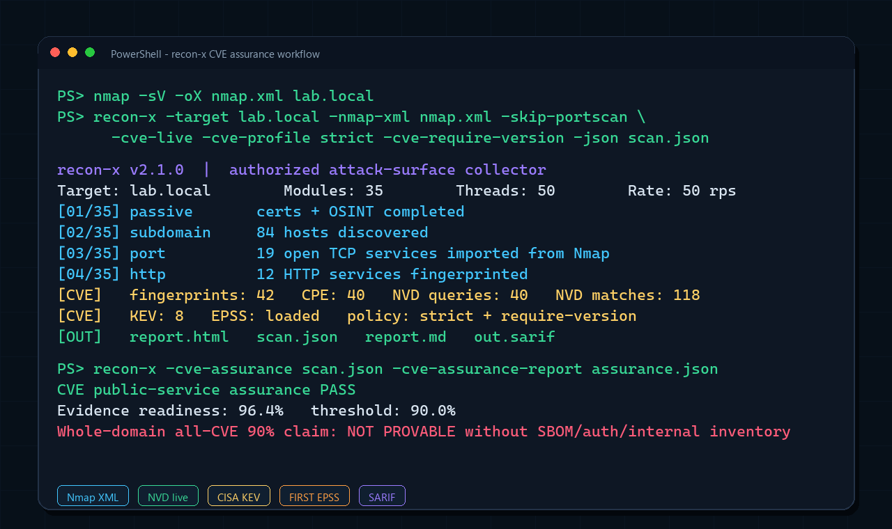
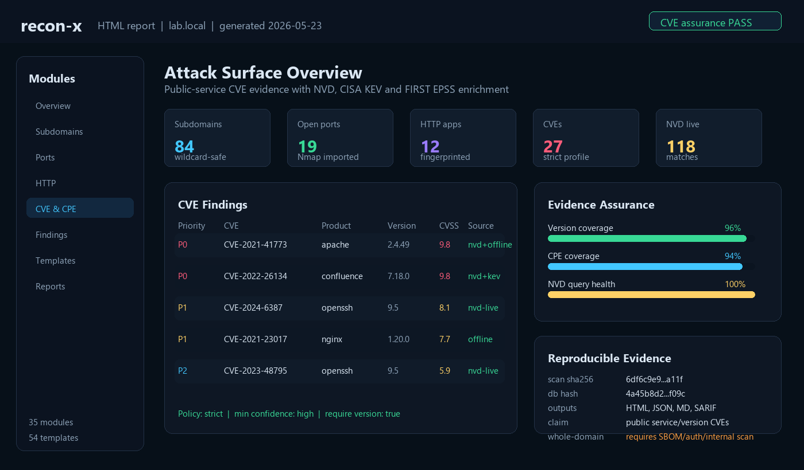

# recon-x


[](https://github.com/bytezora/recon-x/releases)
[](LICENSE)
[](https://github.com/bytezora/recon-x/actions)

Attack surface mapper for authorized security assessments. One command covers 26 recon and discovery checks — from passive OSINT to active probing — and outputs a self-contained HTML report plus optional JSON and SARIF.

> All findings are indicators for manual verification, not confirmed vulnerabilities. HTTP scanning uses `InsecureSkipVerify: true` to handle self-signed certificates during discovery.

---

## Install

**go install**
```bash
go install github.com/bytezora/recon-x@latest
```

**Docker**
```bash
docker pull ghcr.io/bytezora/recon-x:latest
docker run --rm ghcr.io/bytezora/recon-x -target example.com
```

**Pre-built binaries**

Download from [Releases](https://github.com/bytezora/recon-x/releases).

**Build from source**
```bash
git clone https://github.com/bytezora/recon-x.git
cd recon-x
go build -o recon-x .
```

---

## Usage

```bash
recon-x -target example.com
recon-x -target example.com -output report.html -json results.json
recon-x -target example.com -modules subdomain,port,http,sqli
recon-x -target example.com -threads 100 -rate 30 -retries 3
recon-x -target example.com -resume
recon-x -target example.com -sarif results.sarif
recon-x -target example.com -proxy http://127.0.0.1:8080
recon-x -target example.com -config recon.yaml
recon-x -target example.com -github-token ghp_xxxx
recon-x -target example.com -scope-file scope.txt
recon-x -target example.com -notify-slack https://hooks.slack.com/...
recon-x -target example.com -notify-telegram TOKEN@CHATID
echo "example.com" | recon-x
cat targets.txt | recon-x -output report.html
```

### Flags

| Flag | Default | Description |
|------|---------|-------------|
| `-target` | | Target domain (required) |
| `-output` | `report.html` | HTML report output path |
| `-json` | | JSON output path (optional) |
| `-sarif` | | SARIF 2.1.0 output path (optional) |
| `-wordlist` | embedded | Custom subdomain wordlist |
| `-dir-wordlist` | embedded | Custom paths wordlist for directory brute-force |
| `-ports` | common 17 | Comma-separated ports to scan |
| `-threads` | `50` | Number of concurrent goroutines |
| `-rate` | `50` | Max HTTP requests per second |
| `-retries` | `2` | Number of HTTP retries |
| `-resolver` | system | Custom DNS resolver (e.g. `1.1.1.1:53`) |
| `-no-passive` | false | Skip crt.sh passive recon |
| `-github-token` | | GitHub token for code search dorking |
| `-proxy` | | HTTP/HTTPS proxy URL |
| `-scope-file` | | Scope file — one entry per line (`*.example.com`, `10.0.0.0/8`) |
| `-modules` | all | Comma-separated modules to run |
| `-config` | | Path to YAML config file |
| `-output-dir` | | Directory for all output files |
| `-resume` | false | Resume interrupted scan from state file |
| `-notify-slack` | | Slack webhook URL for critical finding alerts |
| `-notify-telegram` | | Telegram `TOKEN@CHATID` for critical alerts |
| `-silent` | false | Suppress all non-critical output |
| `-verbose` | false | Enable verbose output |
| `-version` | | Print version and exit |
| `-db-hash` | | Print CVE database fingerprint and exit |

---

## Modules

| # | Module | What it does |
|---|--------|-------------|
| 1 | passive | crt.sh passive subdomain discovery |
| 2 | subdomain | DNS brute-force with custom wordlist |
| 3 | port | TCP port scan + banner grab |
| 4 | http | HTTP fingerprint, tech stack, WAF detection, CVE matching |
| 5 | dir | Directory brute-force (~80 paths) |
| 6 | js | JS scraping → endpoints + secrets |
| 7 | github | GitHub code search dorking |
| 8 | buckets | S3 / GCS / Azure Blob public bucket check |
| 9 | tls | TLS cert expiry, weak ciphers, SAN mismatch |
| 10 | redirect | Open redirect detection (22 params × 2 payloads) |
| 11 | axfr | DNS zone transfer attempt |
| 12 | whois | WHOIS lookup → registrar, org, ASN |
| 13 | screenshot | Headless HTTP screenshot, embedded in report |
| 14 | takeover | Subdomain takeover via dangling CNAME |
| 15 | cors | CORS misconfiguration scan |
| 16 | bypass | 403 bypass via path tricks and header injection |
| 17 | vhost | Virtual host discovery via Host header brute-force |
| 18 | favicon | Favicon MurmurHash3 fingerprint (Shodan-style) |
| 19 | asn | ASN / BGP prefix lookup |
| 20 | graphql | GraphQL endpoint probe + introspection dump |
| 21 | email | SPF / DMARC / DKIM check, spoofability |
| 22 | admin | Admin panel discovery (50+ real paths) |
| 23 | sqli | SQLi detection: error-based + time-based baseline |
| 24 | creds | Default credentials check (15 pairs) |
| 25 | ratelimit | Rate-limit header detection |
| 26 | templates | 20 built-in YAML templates + custom templates |

Run a subset: `-modules subdomain,port,http,sqli`

---

## CVE detection

190+ signatures across 48 products — Apache, nginx, OpenSSH, Tomcat, WebLogic, Spring, Log4j, Redis, MongoDB, Elasticsearch, WordPress, Drupal, Jenkins, GitLab, Fortinet, Citrix, F5, Kubernetes and more.

Matches on banner strings, HTTP headers, response bodies and version endpoints. Each match carries a Confidence field (`high` / `medium` / `low`). The CVE database is SHA-256 integrity-protected.

WAF vendors: Cloudflare, Akamai, Imperva, AWS WAF, F5, Barracuda, ModSecurity, Fortinet, Radware.

---

## Output

| Format | Flag | Description |
|--------|------|-------------|
| HTML | `-output report.html` | Self-contained dark report, tabbed, all 26 modules |
| JSON | `-json out.json` | Machine-readable, full results |
| SARIF 2.1.0 | `-sarif results.sarif` | GitHub Code Scanning / Defect Dojo compatible |

---

## Config file

```yaml
target: example.com
threads: 100
rate: 30
retries: 3
resolver: 1.1.1.1:53
modules: [subdomain, port, http, tls, sqli, admin]
github_token: ghp_xxxx
output_dir: ./results
notify_slack: https://hooks.slack.com/...
notify_telegram: TOKEN@CHATID
templates:
  - ./my-templates/
```

---

## Terminal UI



---

## Report

Self-contained HTML, dark terminal style. Tabbed — 26 modules visible as tabs.



---

## What's New in v2.0.0

- **Template engine** — 20 built-in YAML templates (CVEs + exposures). Custom templates via `-config`.
- **Rate limiting** — global HTTP rate limiter (`-rate 50`), exponential backoff retries (`-retries 2`).
- **Config file** — full YAML config for all flags.
- **Module selection** — `-modules subdomain,port,sqli` runs only those modules.
- **Resumable scans** — `-resume` continues from last completed step via JSON state file.
- **SARIF output** — `-sarif` for GitHub Actions / Defect Dojo CI pipelines.
- **Scope file** — `-scope-file` restricts results to in-scope domains/CIDRs.
- **Proxy support** — `-proxy http://127.0.0.1:8080` routes all traffic through Burp Suite.
- **Notifications** — `-notify-slack` / `-notify-telegram` for real-time critical finding alerts.
- **CVE confidence** — each CVE match tagged `high/medium/low` to reduce false positive noise.
- **Configurable DNS resolver** — `-resolver 1.1.1.1:53` avoids corporate DNS leakage.
- **SQLi baseline** — time-based + error-based + body-diff baseline reduces false positives.

---

## License

MIT · use only on targets you have permission to scan.