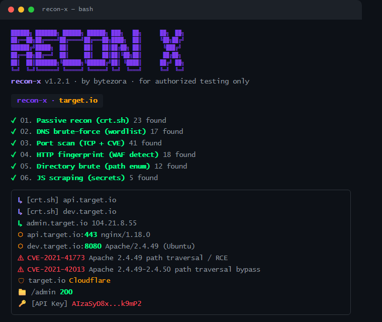
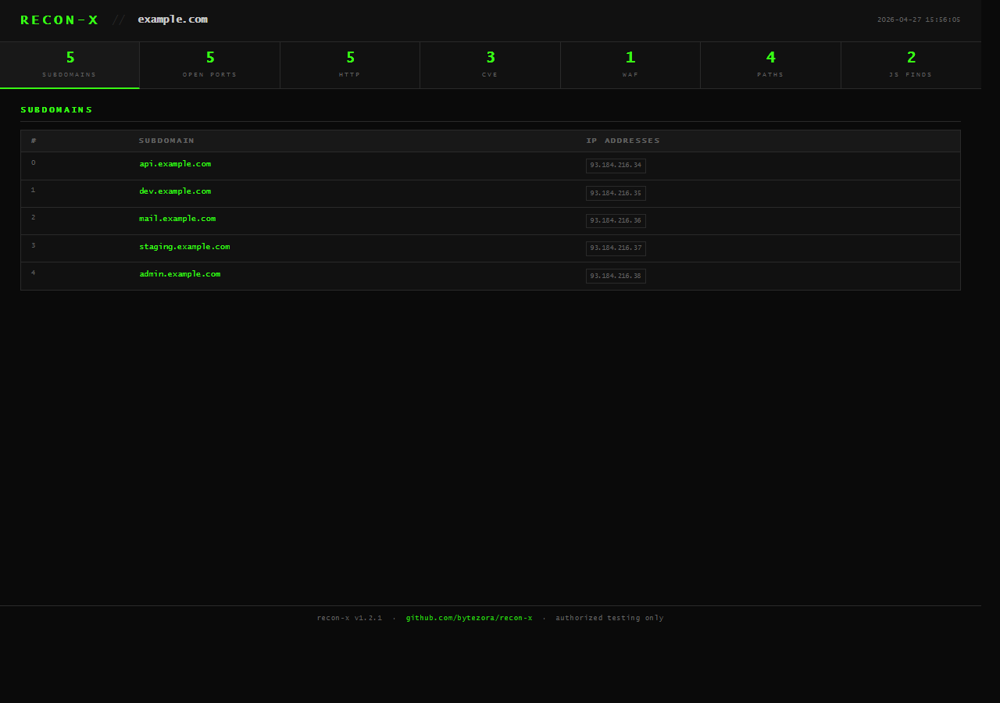
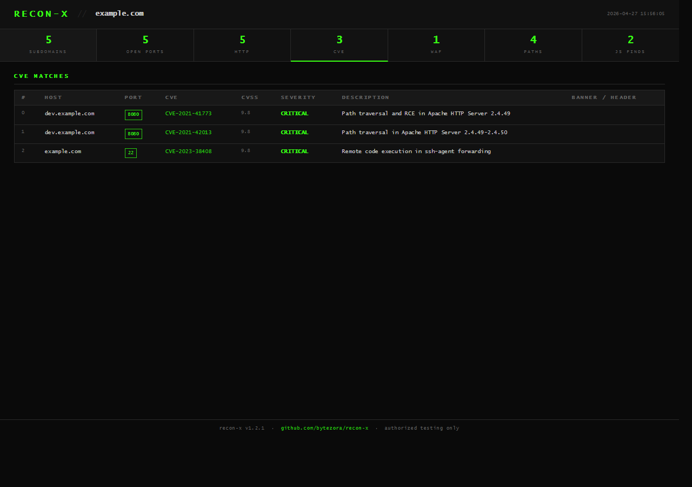

# recon-x


Web recon tool I wrote in Go. One command — passive subdomain discovery, port scan, CVE matching, WAF detection, dir brute-force, JS secret extraction, GitHub dorking, and cloud bucket enumeration. Outputs an HTML report and optional JSON.

---

## Install

```bash
go install github.com/bytezora/recon-x@latest
```

or build from source:

```bash
git clone https://github.com/bytezora/recon-x && cd recon-x
go build -o recon-x .
```

---

## Usage

```bash
recon-x -target example.com
recon-x -target example.com -output report.html -json out.json -threads 100
recon-x -target example.com -no-passive -ports 80,443,8080,8443
recon-x -target example.com -github-token ghp_xxxx
```

```
-target         domain to scan                     (required)
-output         html report path                   (default: report.html)
-json           json output                        (optional)
-wordlist       custom subdomain wordlist
-ports          comma-separated ports
-threads        concurrency                        (default: 50)
-no-passive     skip crt.sh lookup
-github-token   GitHub PAT for code search dorking (optional)
-version        print version
```

---

## What runs

```
1. crt.sh passive recon
2. DNS subdomain brute-force
3. TCP port scan → banner grab → CVE match
4. HTTP fingerprint → tech stack → WAF detection
5. Directory brute-force (~80 paths)
6. JS scraping → endpoints + secrets
7. GitHub dorking → leaked keys/tokens in code
8. Cloud bucket enum → S3 / GCS / Azure
   → HTML report + optional JSON
```

---

## Terminal UI



---

## Report

Self-contained HTML, Lucida Console, dark terminal style. Tabbed — subdomains, ports, HTTP, CVE, WAF, dirs, JS secrets, GitHub leaks, cloud buckets.





---

## CVE detection

190+ signatures across 48 products — Apache, nginx, OpenSSH, Tomcat, WebLogic, Spring, Log4j, Redis, MongoDB, Elasticsearch, WordPress, Drupal, Jenkins, GitLab, Fortinet, Citrix, F5, Kubernetes and more.

Matches on banner strings, HTTP headers, response bodies and version endpoints (`/actuator/info`, `/_cluster/stats`, etc.). DB is SHA-256 protected.

WAF vendors: Cloudflare, Akamai, Imperva, AWS WAF, F5, Barracuda, ModSecurity, Fortinet, Radware.

---

## License

MIT · use only on targets you have permission to scan.
